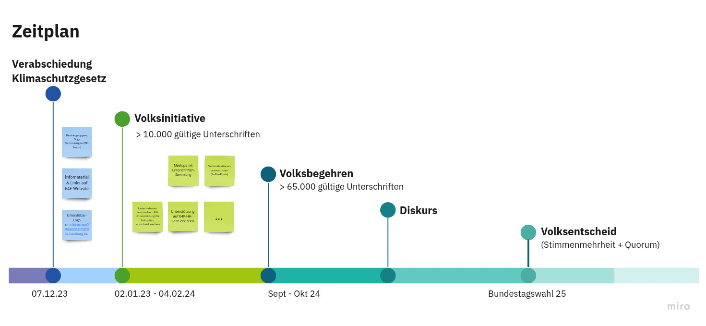

<header class="masthead">
    

        

            
Zukunftsentscheid Hamburg

        

    

</header>

<section class="page-section">
  

## Informationen
{:class="section-heading text-uppercase text-center"}

Worum geht es, wie kann man mitmachen und wie wird das Ganze organisiert? Das findet ihr auf der Seite des [Zukunftsentscheids Hamburg](https://zukunftsentscheid-hamburg.de/).

{:class="img-fluid d-block mx-auto"}

## Material
{:class="section-heading text-uppercase text-center"}

* In der Volksinitiative zur Abstimmung gestelltes [Klimaschutzverbesserungsgesetz](https://zukunftsentscheid-hamburg.de/inhalte/der-gesetzestext/) (mit Markierung der Änderungen gegenüber dem Hamburger Klimaschutzgesetz)
* [Begründung](https://zukunftsentscheid-hamburg.de/inhalte/die-gesetzesbegruendung/) des Klimaschutzverbesserungsgesetzes
* Alle Informationen zum [Unterschriften-Sammeln](https://zukunftsentscheid-hamburg.de/unterschriften-sammeln/)
* Download des [Unterschrift-Formulars](https://zukunftsentscheid-hamburg.de/wp-content/uploads/2024/01/Volksinitiative-Klimaschutzverbesserungsgesetz-Unterschriftenliste.pdf) (bitte nur zusammen mit dem [Listenanhang](https://zukunftsentscheid-hamburg.de/wp-content/uploads/2024/01/Volksinitiative-Klimaschutzverbesserungsgesetz-Listenanhang.pdf) mit Gesetzestext, Begründung und Datenschutzhinweis weitergeben)

## Weitere Links
{:class="section-heading text-uppercase text-center"}

* [Hamburger Klimaplan und zugrundeliegende Szenarien](https://www.hamburg.de/klima/publikationen/16763684/szenarienhamburgerklimaplan/)
* [German Zero Studien](https://germanzero.de/downloads)
 

</section>